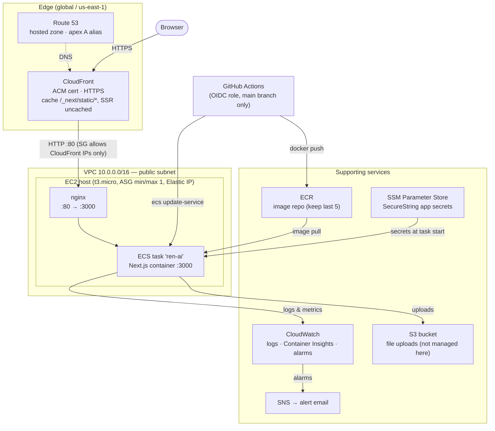

# The RenAIssance Fan

> Fallibly human, artificially divine.

The RenAIssance Fan is a Next.js blog/zine about AI, written by a human author with an AI sub-editor. Content is organized into **Issues** (numbered collections), each carrying **Posts**, **Dispatches**, **Field Notes**, and a curated **Tools & Contraptions** cabinet. Every published piece carries a "Production Record" spec sheet — model version, token count, and the prompt behind it — so the human/AI provenance of the writing is never hidden.

## Stack

- **Next.js 16** (App Router) + React 19, styled with Tailwind CSS v4
- **Drizzle ORM** over SQLite/[libSQL](https://turso.tech) — local file DB by default, Turso in production
- **Auth.js** (NextAuth v5) with GitHub/Google OAuth, gating the `/admin` panel
- **TipTap** rich-text editor for authoring posts, with markdown import/export and KaTeX math
- **S3** (via `@aws-sdk/client-s3`) for uploaded images/assets
- Content pages render server-side; the admin app is where issues, posts, tools, and static pages get written

## Getting started

This repo uses **pnpm only** (pinned via the `packageManager` field in `package.json`; run `corepack enable` if you don't have pnpm). Install dependencies and run the development server:

```bash
pnpm install
cp .env.example .env
pnpm db:push
pnpm dev
```

Open [http://localhost:3000](http://localhost:3000) to see the site, and [http://localhost:3000/admin](http://localhost:3000/admin) for the editor (sign in via GitHub/Google OAuth — see `.env.example` for the required app credentials).

By default the app uses a local SQLite file (`local.db`). To point at a hosted Turso database instead, set `TURSO_DATABASE_URL` and `TURSO_AUTH_TOKEN` in `.env`. File uploads require the four `AWS_*`/`S3_*`/`NEXT_PUBLIC_S3_URL` variables — see the comments in `.env.example` for the bucket policy uploads need.

## Scripts

```bash
pnpm dev              # start the dev server
pnpm build / start     # production build / serve
pnpm lint / format     # eslint / prettier
pnpm test / test:watch # vitest unit tests
pnpm db:push            # push schema.ts changes straight to the DB (dev)
pnpm db:generate        # generate a migration from schema changes
pnpm db:migrate         # apply migrations
pnpm db:studio          # Drizzle Studio DB browser
```

## Project layout

```
src/app/(site)/   public pages — issues, posts, dispatches, field notes, tools, about
src/app/admin/    authenticated editor for issues, posts, tools, and static pages
src/app/api/      route handlers (auth, comments, uploads, subscribe, content CRUD)
src/db/           Drizzle schema and client
src/actions/      server actions
src/services/     application/business logic
src/components/   shared UI (site chrome, post cards, spec-sheet components, editor)
drizzle/          generated SQL migrations
scripts/          maintenance scripts, incl. token-cost tracking (see token-costs.config.json)
```

This is _not_ the Next.js you may know from training data — see `AGENTS.md` for what's changed and where to find the bundled docs before writing App Router code.

## AWS Infrastructure

Production runs on AWS, provisioned by Terraform in [`infra/`](infra/). It is a deliberately small single-instance stack: CloudFront terminates TLS at the edge and forwards to one EC2 host running the app as an ECS task behind nginx.



### How the pieces fit

- **DNS & TLS** — a Route 53 hosted zone serves the apex domain, aliased to a CloudFront distribution. The ACM certificate is DNS-validated and issued in us-east-1 (a CloudFront requirement, hence the second provider alias in `main.tf`).
- **CDN behavior** — SSR routes use the `CachingDisabled` policy and forward all cookies/headers/query strings, so auth and dynamic pages behave exactly as at origin. `/_next/static/*` (immutable hashed assets) uses `CachingOptimized` for long-lived edge caching.
- **Compute** — an ECS cluster on the EC2 launch type, backed by a single-instance Auto Scaling Group (t3.micro). The ECS service runs one task (bridge networking, port 3000) with a rolling stop-then-start deploy (~15s downtime, no ALB) and a deployment circuit breaker that auto-rolls-back failed releases.
- **Networking** — the host sits in one public subnet with an Elastic IP it associates to itself on boot (`user_data.sh.tpl`). Its security group only accepts port 80 from CloudFront's origin-facing IP ranges, so the public internet can't bypass the CDN. nginx on the host proxies 80 → 3000; the container port is only reachable from the host SG.
- **Secrets** — app env vars (auth, Turso, S3 credentials) live in SSM Parameter Store as SecureStrings under `/ren-ai/*` and are injected into the container at task start by the ECS execution role.
- **CI/CD** — GitHub Actions assumes an OIDC-federated IAM role (scoped to pushes to `main` on this repo) to push images to ECR and call `ecs:UpdateService`. ECR keeps the last 5 tagged images.
- **Monitoring** — CloudWatch alarms for site down (`RunningTaskCount < 1` via Container Insights), high CPU, and high memory (via the CloudWatch agent installed in user data), plus an EventBridge rule for deployment circuit-breaker failures — all notify an SNS topic with an email subscription.
- **Shell access** — no bastion or SSH key; the instance role includes `AmazonSSMManagedInstanceCore`, so use SSM Session Manager.

Terraform state is local (not committed); each operator keeps their own state file. Secrets come from `terraform.tfvars` (copy `terraform.tfvars.example`).
